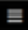

## Getting Started

For many, the Internet of Things (IoT) can seem like a difficult challenge, especially thinking through getting an end-to-end IoT Solution out the door (or stood up for the first time).  In this post, we'll take you step-by-step through the process of setting up your own personal temperature sensor with IoT Ensemble.  Here's a look at what we'll do:

- Configure and set up a Raspberry Pi
- Connect a temperature sensor
- Read the data with Node-Red
- Use IoT Ensemble to stream sensor data
- Leverage helpful data tools from your dashboard
- Visualize your data with PowerBI

This may seem like a lot, and can take some teams weeks or even months.  So grab your gear, and we'll have you up and running in the next 30 - 60 minutes.

### Things you will need

In this walk through, we use the Model 3B Raspberry Pi (but you can use a Model 4 as well) and a DHT11 sensor.  If your like me, you may have as many as 3 or more Raspberry Pis laying around your house.  Mix this with a multitude of sensors and starter kits, and you'll quickly get a sense for why my wife made me move to the garage.  

If this is you, dust off an RPi and if you don't have a DHT11, grab another sensor and make the necessary adjustments when we hook up Node Red.  If that isn't you or your somewhere in between, you may have to make a few quick purchases and gather some supplies:

- [Raspberry Pi](https://www.amazon.com/CanaKit-Raspberry-Premium-Clear-Supply/dp/B07BC7BMHY/ref=sr_1_8?dchild=1&keywords=raspberry+pi&qid=1611254779&sr=8-8) with a Power Source
- [MicroSD card](https://www.amazon.com/SanDisk-Ultra-microSDHC-Memory-Adapter/dp/B08GY9NYRM/ref=sr_1_3?crid=2XJMC54SCHQQD&dchild=1&keywords=micro+sd+card+32gb&qid=1610743336&sprefix=micro+sd+card%2Caps%2C229&sr=8-3), at least 16GB
- [DHT11 humidity/temperature sensor w/ wires](https://www.amazon.com/HiLetgo-Temperature-Humidity-Digital-3-3V-5V/dp/B01DKC2GQ0)
- A [Fathym IoT Ensemble](https://www.iot-ensemble.com/dashboard) account (we’re using the free, shared version)
- [Power BI desktop](https://powerbi.microsoft.com/en-us/downloads/)
- A USB Keyboard and mouse
- A computer monitor
- Your normal computer with an SD card reader (or you can buy an SD to USB dongle)

## Part 1: Setting up the Raspberry Pi

This process includes putting the Raspberry Pi Operating System (formerly known as Raspbian) onto your micro SD card and interacting with the Pi to complete initial setup (Connect to Wifi, allow permissions to access your Pi from another computer, etc).

The official Raspberry Pi website has an excellent tool called the [Raspberry Pi Imager](https://www.raspberrypi.org/software/), which walks you through the process of creating an SD card that will power and control your Raspberry PI.

:::note

For more information on the RPi imager, [read here](https://www.raspberrypi.org/blog/raspberry-pi-imager-imaging-utility/).

:::

Now that you have your SD card ready to go, we can fire up the Pi! You will need to plug your keyboard and mouse into 2 of the 4 USB inputs on the Pi, and plug in a monitor with an HDMI cable.

Once all peripherals are connected, plug in the power source and connect it to the Pi. This should open the Raspberry Pi OS first time setup wizard on the monitor.  Navigate through the provided steps, which will include connecting the Pi to WiFi.

:::note

More information on that wizard process can be found [here](https://www.raspberrypi.org/blog/raspbian-update-june-2018/).  You can skip over the “Recommended Software” portion if desired, it is not important to this tutorial

:::

## Part 2 - Installing Software on the Raspberry Pi

After completing the setup steps in Part 1, you will be taken to the main Raspberry Pi desktop.  In the top left, click on the Raspberry logo, which will show a drop down of options.  Click on the **Programming** tab, then click **Terminal**.

In order to program our Pi and get connected, we will need to install a couple of tools first, mainly Node.js and Node-Red by completing the following terminal commands:

1. To update the system package list run  
`sudo apt-get update`  
2. Install the latest versions of system packages with  
`sudo apt-get dist-upgrade`  
3. Get the Node.js package we need to install by running  
`curl -sL https://deb.nodesource.com/setup_8.x | sudo -E bash`  
4. To install the Node.js package  
`sudo apt-get install -y nodejs`  
5. Finally download and install Node Red with command  
`bash <(curl -sL https://raw.githubusercontent.com/node-red/linux-installers/master/deb/update-nodejs-and-nodered)`

Once all commands have been run in the terminal, the RPi is setup with Node Red.

## Part 3 - Wire up the DHT11 Sensor

Next, we need to wire up the DHT11 sensor to the Raspberry Pi. Thankfully, this simple sensor doesn’t need any complex wiring, resistors, or breadboards. Simply follow the wiring diagram provided below:


## Part 4 - Using Node-Red to Read Sensor Data

Once you’re done wiring your sensor, go back to your terminal window on the Raspberry Pi. Then enter the command `node-red-start` which will start the node red service. When the service starts, the terminal will look similar to this:


In the top right, there will be a URL that usually starts with '**http://192…**' (inside the red box above). You can then use the built in Raspberry Pi web browser to navigate to this website.  You will then be taken to a screen that looks like this:


Welcome to Node-Red! There are a few additional modules that we will need in order to create our device flow. In the top right corner of the screen, click on the , and then click **Manage palette**. On the new screen, click on the **Install** tab. In the search bar, type in the following and install each of them:

- node-red-contrib-azure-iot-hub
- node-red-contrib-dht-sensor

For the sake of simplicity, we are able to import previously created flows into Node Red. The following flow template takes temperature and humidity information from the DHT11, formats the JSON payload to use [IoT Ensemble's Best Practice Schema](http://www.iot-ensemble.com/docs/developers/device-setup/iot-best-practice-schema-explained) (in addition, uses a few extra fields like **key** and **protocol** to work with the Azure IoT Hub module), and takes a reading every 30 seconds. To use this template, copy the following Node-Red JSON template:

```json
[{"id":"e97f8ba8.2829d8","type":"tab","label":"DHT11 Sensor to Fathym IoT Ensemble","disabled":false,"info":""},{"id":"2fe1190e.141286","type":"inject","z":"e97f8ba8.2829d8","name":"Take reading every 30 seconds","props":[{"p":"payload"}],"repeat":"30","crontab":"","once":true,"onceDelay":0.1,"topic":"","payload":"","payloadType":"date","x":190,"y":440,"wires":[["2f3407d4.26b858"]]},{"id":"2f3407d4.26b858","type":"rpi-dht22","z":"e97f8ba8.2829d8","name":"DHT11 Sensor","topic":"","dht":"11","pintype":"0","pin":4,"x":500,"y":440,"wires":[["1fa2f6c2.9637b9"]]},{"id":"1fa2f6c2.9637b9","type":"change","z":"e97f8ba8.2829d8","name":"Format JSON","rules":[{"t":"set","p":"payload","pt":"msg","to":"{\t\t\"deviceId\": \"Your Device ID\",\t\t\"key\": \"Your Device Key\",\t\t\"protocol\": \"mqtt\",\t\t\"data\": {\t\t\"DeviceData\": {\t\t\t\"Latitude\": \"40.5853° N\",\t\t\t\"Longitude\": \"105.0844° W\"\t\t},\t\t\"SensorReadings\": {\t\t\t\"Temperature\": $number(payload),\t\t\t\"Humidity\": $number(humidity)\t\t},\t\t\"SensorMetadata\": {\t\t\t\"_\": {\t\t\t\t\"SignalStrength\": \"Good\",\t\t\t\t\"SensorType\": \"DHT11\"\t\t\t}\t\t}\t\t}\t}","tot":"jsonata"}],"action":"","property":"","from":"","to":"","reg":false,"x":760,"y":440,"wires":[["8601cbe1.84e998","fc1e92ea.2210b"]]},{"id":"8601cbe1.84e998","type":"debug","z":"e97f8ba8.2829d8","name":"Local Debug","active":true,"tosidebar":true,"console":false,"tostatus":false,"complete":"payload","targetType":"msg","statusVal":"","statusType":"auto","x":990,"y":360,"wires":[]},{"id":"fc1e92ea.2210b","type":"azureiothub","z":"e97f8ba8.2829d8","name":"Azure IoT Hub", "protocol":"mqtt","x":1000,"y":520,"wires":[[]]}]
```

In the Node-Red browser screen, click on the  at the top right of the screen, and choose **Import**. Paste the JSON into the text box, and click **Import**. You will now have a visual representation of the flow of data from the device.

:::note

If you chose to use a sensor other than the DHT11, you can still start from the provided template.  Once the template is imported, you can work with Node Red to swap out the dht-sensor for the one you chose.  Node Red packages for your devices can be found by [searching here](https://flows.nodered.org/search?term=dht11).

:::

Before we start sending actual device readings, we first need to provide Node Red some device conifguration information. This is where IoT Ensemble comes in!

## Part 5 - Setting Up IoT Ensemble

Before we can tell your device where to send data, we first need somewhere to send the data.  There are a number of different ways this can be accomplished, with IoT Ensemble the focus is helping you leverage best practice cloud IoT technology.  Here we'll using the Azure IoT Hub to connect devices to a shared data flow, and then make it avaiable downstream for use in other applications.

Follow these steps to create a new device in IoT Ensemble. For more details on the full IoT ensemble experience, check out our [full documentation](https://www.iot-ensemble.com/docs/getting-started/connecting-first-device).

Start by navigating to the [IoT Ensemble Dashboard](https://www.iot-ensemble.com/dashboard) and sugn in or sign up.  For the purposes of moving forward, you will only need the Free license and no credit card will be required.

### Enrolling a Device

In the **Connected Devices** section, click the **Enroll New Device** button, provide a name for your device (i.e. my-first-device) and click **Enroll Device**.  That’s it!  Your device is now registered and should be visible in the dashboard, along with its associated connection string.


Click on the  button to copy your connection string to your clipboard. Your connection string should look something like this:

> HostName=fathym-prd.azure-devices.net;DeviceId=**YourDeviceID**;SharedAccessKey=**YourDeviceKey**

Within the connection string, there are two key parts that we need: The **DeviceID**, and the **SharedAccessKey**. Both of these values need to be a part of the data payload. Let's add them to the payload now.

 Copy both the **YourDeviceID** and **YourDeviceKey** portions of your connection string (not including the "**DeviceId=**", "**SharedAccessKey=**", or the "**;**" at the end of DeviceID).  Go back to your Node-Red browser, and double click on the yellow **Format JSON** module, which will pull up a **Properties** screen, shown below.


:::note

**Note**: For this specific example, **DeviceID** has to be entered twice. This is because the Azure IoT Hub module requires the deviceID in order to build a connection string. The IoT Hub itself also requires a DeviceID in the data payload.

:::

Next, click on the three-dot menu screen (shown in the red box above). This will pull up an "Edit" screen, shown below:


 From here, take the **YourDeviceID** and **YourDeviceKey** values from your connection string and paste them into the properties shown in the red boxes above. Click "Done"

Once this is complete, click the red "Deploy" button in the top right corner. Your pi is now sending real time data to IoT Ensemble!
