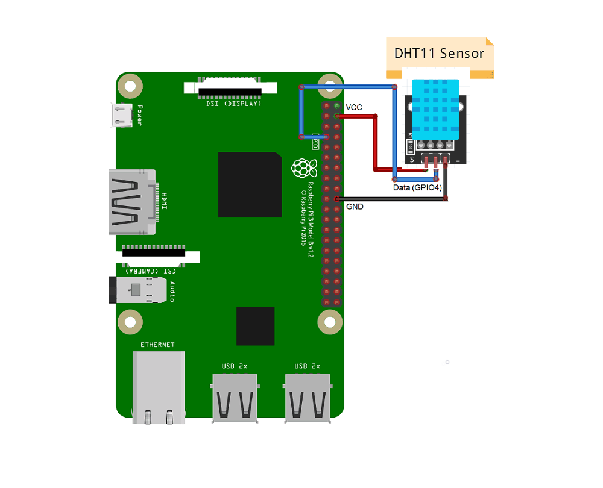
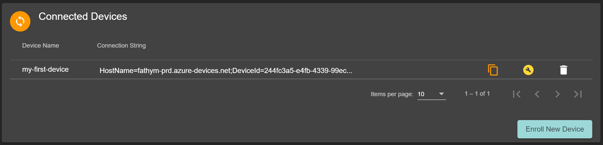
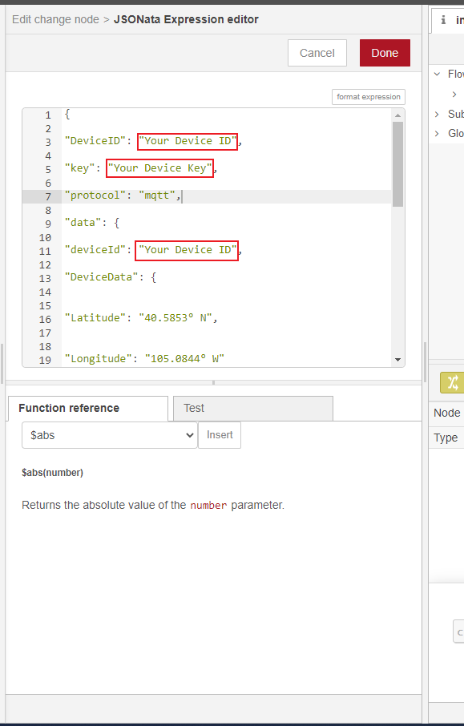

# Connecting your first Pi and DHT11 with IoT ensemble and a PowerBI dashboard


This will take you through, step-by-step, the process of setting up your own personal temperature sensor by:
Configuring and setting up a Raspberry Pi
Connecting a simple temperature sensor to your Raspberry Pi, and reading the data with Node-Red
Using IoT Ensemble to listen to your Pi, and provide you with a suite of helpful data tools (the easy part!)
Take your data to set up a PowerBI visualization


### Things you will need:
<ul>
<li>Raspberry Pi with a Power Source (we will be using the Model 3B in this example, but you can use a Model 4 as well) </li>
<li>A <a href="https://www.amazon.com/SanDisk-Ultra-microSDHC-Memory-Adapter/dp/B08GY9NYRM/ref=sr_1_3?crid=2XJMC54SCHQQD&dchild=1&keywords=micro+sd+card+32gb&qid=1610743336&sprefix=micro+sd+card%2Caps%2C229&sr=8-3">MicroSD card</a>, at least 16GB</li>
<li>A <a href="https://www.amazon.com/HiLetgo-Temperature-Humidity-Digital-3-3V-5V/dp/B01DKC2GQ0">DHT11 humidity/temperature sensor w/ wires</a></li>
<li>A USB Keyboard and mouse</li>
<li>A computer monitor</li>
<li>Your normal computer with an SD card reader (or you can buy a SD to USB dongle)</li>
<li>A Fathym IoT Ensemble account (we’re using the free, shared version)</li>
<li>A PowerBI account</li>
</ul>

## Part 1: Setting up your new Raspberry Pi 

This process includes putting the Raspberry Pi Operating System (formerly known as Raspbian) onto your micro SD card and interacting with the Pi to complete initial setup (Connect to Wifi, allow permissions to access your Pi from another computer, etc).

The official Raspberry Pi website has an excellent tool called the Raspberry Pi Imager, which walks you through the process of creating an SD card that will power and control your Raspberry PI
https://www.raspberrypi.org/software/

Now that you have your SD card ready to go, we can fire up the Pi! You will need to plug in your keyboard and mouse into 2 of the 4 USB inputs. You will also need to plug in your monitor with an HDMI cable into your Pi.

Once you get all your peripherals connected, plug in the power source and connect to the raspberry Pi. On your monitor, the Raspberry Pi OS first time setup wizard should show up. Navigate through the provided steps, which will include connecting your Raspberry Pi to your WiFi. More information on that wizard process can be found here: https://www.raspberrypi.org/blog/raspbian-update-june-2018/ (Note: you can skip over the “Recommended Software” portion, it is not important to this tutorial)

After you complete the setup steps, you will be taken to the main Raspberry Pi desktop.

## Part 2 - Install Necessary Software to your Pi

In the top left, click on the Raspberry logo, which will show a drop down of options. Click on the “Programming” tab, then click “Terminal”.

In order to program our Pi to do what we want, we need to install a couple of tools first, mainly Node.js and Node-Red 
Enter the command ```sudo apt-get update``` which updates your system package list
Enter the command ```sudo apt-get dist-upgrade which installs the latest versions of your system packages```
Enter the command ```curl -sL https://deb.nodesource.com/setup_8.x | sudo -E bash``` - which grabs the Node.js package we need to install
Enter the command ```sudo apt-get install -y nodejs``` which installs the package we just grabbed in the previous step
Enter the command ```bash <(curl -sL https://raw.githubusercontent.com/node-red/linux-installers/master/deb/update-nodejs-and-nodered)```  This will run a script that automatically installs Node Red to your Pi


## Part 3 - Wire up your DHT11 sensor

Next, we need to wire up your DHT11 sensor to your raspberry Pi. Thankfully, this simple sensor doesn’t need any complex wiring, resistors, or breadboards. Simply follow the wiring diagram provided below:




## Part 4 - Using Node-Red to Read your Sensor Data

Once you’re done wiring your sensor, go back to your terminal window on the Raspberry Pi. Then enter this command: node-red-start which will start the node red service. When the service starts, it will look similar to this:


In the top right, there will be a URL that usually starts with “http://192…” (inside the red box above). You can then use the built in Raspberry Pi web browser to navigate to this website.  You will then be taken to a screen that looks like this:


Welcome to Node-Red! There are a few additional modules that we will need in order to create our device flow. In the top right corner of the screen, click on the three horizontal line button, and then click “Manage palette”. On the new screen, click on the “Install” tab. In the search bar, type in the following and install each of them:
<br>
node-red-contrib-azure-iot-hub<br>
node-red-contrib-dht-sensor
<br>
For the sake of simplicity, we are able to import previously created flows into Node Red. The following flow template takes temperature and humidity information from the DHT11, formats the JSON payload to use Fathyms Best Practice Schema (in addition, uses a few extra fields like “key” and “protocol” to work with Azure Iot Hub module), and takes a reading every 30 seconds. To use this template, copy the following Node-Red JSON template

```json
[{"id":"e97f8ba8.2829d8","type":"tab","label":"DHT11 Sensor to Fathym Iot Ensemble","disabled":false,"info":""},{"id":"2fe1190e.141286","type":"inject","z":"e97f8ba8.2829d8","name":"Take reading every 30 seconds","props":[{"p":"payload"}],"repeat":"30","crontab":"","once":true,"onceDelay":0.1,"topic":"","payload":"","payloadType":"date","x":190,"y":440,"wires":[["2f3407d4.26b858"]]},{"id":"2f3407d4.26b858","type":"rpi-dht22","z":"e97f8ba8.2829d8","name":"DHT11 Sensor","topic":"","dht":"11","pintype":"0","pin":4,"x":500,"y":440,"wires":[["1fa2f6c2.9637b9"]]},{"id":"1fa2f6c2.9637b9","type":"change","z":"e97f8ba8.2829d8","name":"Format JSON","rules":[{"t":"set","p":"payload","pt":"msg","to":"{\t\t\"deviceId\": \"Your Device ID\",\t\t\"key\": \"Your Device Key\",\t\t\"protocol\": \"mqtt\",\t\t\"data\": {\t\t\"DeviceData\": {\t\t\t\"Latitude\": \"40.5853° N\",\t\t\t\"Longitude\": \"105.0844° W\"\t\t},\t\t\"SensorReadings\": {\t\t\t\"Temperature\": $number(payload),\t\t\t\"Humidity\": $number(humidity)\t\t},\t\t\"SensorMetadata\": {\t\t\t\"_\": {\t\t\t\t\"SignalStrength\": \"Good\",\t\t\t\t\"SensorType\": \"DHT11\"\t\t\t}\t\t}\t\t}\t}","tot":"jsonata"}],"action":"","property":"","from":"","to":"","reg":false,"x":760,"y":440,"wires":[["8601cbe1.84e998","fc1e92ea.2210b"]]},{"id":"8601cbe1.84e998","type":"debug","z":"e97f8ba8.2829d8","name":"Local Debug","active":true,"tosidebar":true,"console":false,"tostatus":false,"complete":"payload","targetType":"msg","statusVal":"","statusType":"auto","x":990,"y":360,"wires":[]},{"id":"fc1e92ea.2210b","type":"azureiothub","z":"e97f8ba8.2829d8","name":"Azure IoT Hub","protocol":"mqtt","x":1000,"y":520,"wires":[[]]}]
```

In your Node-Red browser screen, click on the three horizontal line button at the top right of the screen, and choose “Import”. Paste the JSON into the text box, and click “Import”. You will now have a visual representation of the flow of data from your device.
<br>
Before we start sending actual device readings, we first need to provide Node-Red some information for your device. This is where IoT Ensemble comes in!

## Part 5 - Register your Device with IoT Ensemble
Before we can tell your device where to send data, we first need to register the device. Follow these steps to create a new device in Iot Ensemble. For more details, check out our [full documentation.](../docs/getting-started/connecting-first-device)

<ol>
<li>Navigate to iot-ensemble.com/dashboard</li>
<li>In the “Connected Devices” section, click the “Enroll New Device” button</li>
<li>Provide a name for your new device and click “Enroll Device”</li>
</ol>

That’s it! Your device is now registered. You should now see your newly created device, along with its associated connection string, in the “Connected Devices” section. 



Click on the  button to copy your connection string to your clipboard. Your connection string should look something like this:

> HostName=fathym-prd.azure-devices.net;DeviceId=**YourDeviceID**;SharedAccessKey=**YourDeviceKey**

Within the connection string, there are two key parts that we need: The device ID, and the device key. Both of these values need to be a part of our data payload. Let's add them to our payload now.

<ul>
<li> Copy both the **YourDeviceID** and **YourDeviceKey** portions of your connection string (not including the "DeviceId=", "SharedAccessKey=", and the ";" at the end of DeviceID)</li>
<li> Go back to your Node-Red browser, and double click on the yellow "Format JSON" module. This will pull up a "Properties" screen, shown below.</li>


<li> Next, click on the three-dot menu screen (shown in the red box above). This will pull up an "Edit" screen, shown below</li>



<li> From here, take the DeviceID and Key values from your connection string, and paste them into the properties shown in the red boxes above. Click "Done"</li>
</ul>

Once this is complete, click the red "Deploy" button in the top right corner. Your pi is now sending real time data to IoT Ensemble!


